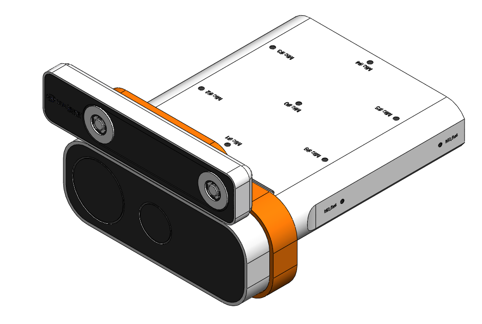

# Deploy on Real Camera

## Printing a camera mount

We provide a STL file of the camera mount at `assets/mount.STL`.
Please print the mount with 3D printer and place the Intel T265 camera on top of the Azure Kinect as follows:



- Take off the lid of the Azure Kinect and slide the mount from the bottom.
- After you place the mount as in the picture, secure with the lid of the Azure Kinect.

## Azure Kinect

Please follow this [wiki](https://github.com/UARK-AICV/UARK-AICV.github.io/wiki/Azure-Kinect#install-azure-kinect-sdk-on-ubuntu-2004) to install the Azure Kinect SDK on Ubuntu 20.04.

## Intel T265

Please follow this [wiki](https://github.com/UARK-AICV/UARK-AICV.github.io/wiki/T265#setup) to setup the Intel T265 camera with librealsense2.

## Run

After setting up the cameras, you can run the server script to stream the camera data:

```bash
python server.py
```